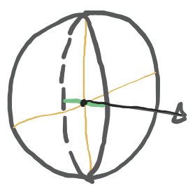

### Skeleton Extraction

该方法参考自 [Tagliasacchi et al. 2009](https://dl.acm.org/doi/epdf/10.1145/1531326.1531377)

使用 ROSA( generalized rotational symmetry axis) Points 来表达点云骨架。

$$
r_p = (\mathbf{x}_p, \mathbf{v}_p), p \in \mathcal{P}_D
$$

用于计算 ROSA 的点云 $\mathcal{P}_D$ 下采样自 *输入点云* $\mathcal{P}_O$

求解方法：

1. 确定锚点以及最佳切割平面
2. 确定对应的邻域 $\mathcal{N}_p$，依赖于定义的距离，参考自 [Lehtinen et al. 2008](https://dl.acm.org/doi/epdf/10.1145/1360612.1360636)。

$$
\mathrm{dist}({r_p}_i,{r_p}_j) = \left\| 
{\mathbf{x}_p}_i - {\mathbf{x}_p}_j + F_{squash} 
\left< {\mathbf{x}_p}_i -  {\mathbf{x}_p}_j, {\mathbf{v}_p}_j \right>
{\mathbf{v}_p}_j 
\right\|
$$

> 这个距离定义可以让 ${r_p}_j$ 周围的等值面（iso-surface）是一个椭球，且该椭球跟 ${\mathbf{v}_p}_j$ 对齐的轴会比其他两个轴短 $1/(1 + F_{squash})$。这意味着当 ${\mathbf{x}_p}_i$ 偏离于和 ${\mathbf{x}_p}_j$ 相切的平面时，距离会增长得更快。我们使用 $F_{squash} = 2$，这是一种马氏距离。

> 

3. 计算 $\mathbf{v}_p$，通过最小化该向量与邻域内的法向量角度方差

$$
\mathbf{v}_p^{i+1} = \mathop{\mathrm{argmin}}\limits_{\mathbf{v}_p \in \mathbb{R}^3,\left\| \mathbf{v}_p  \right\|_2 = 1} 
\mathrm{var}\left\{ \left< \mathbf{v}_p^i, \mathbf{n}(p_k) \right> \ : \ p_k \in \mathcal{N}_p^{(i)} \right\}
$$

$$
\mathbf{v}_p^{i+1} = \mathop{\mathrm{argmin}}\limits_{\mathbf{v}_p \in \mathbb{R}^3,\left\| \mathbf{v}_p  \right\|_2 = 1} 
{\mathbf{v}_p^i}^T \Sigma_p^i \mathbf{v}_p^i
$$

4. 计算 $\mathbf{x}_p$，相当于最小化该点到邻域内点的沿着法向延长的直线的距离平方和

$$
\mathbf{x}_p = 
\mathop{\mathrm{argmin}}\limits_{\mathbf{x}_p \in \mathbb{R}^3} \sum_{p_k \in \mathcal{N}_p} \left\| (\mathbf{x}_p - p_k) \times \mathbf{n}(p_k) \right\|^2
$$

### Skelekon Decomposition

度数大于 2 的节点称为 joint；度数等于 1 的节点称为 leaf。

branch 终止于 joint 或 leaf。

1. DFS 深度优先从每个 joint 出发，得到一个个 branch 
2. 对第一步得到的 branch 作进一步的细分，为的是让单个 branch 的几何足够简单

### Space Allocation 

论文中的方式是根据计算出来的 ROSA points，确定出一个个平面，判断那些点云属于这个平面（根据点到平面的距离来衡量），然后点云就被归属到 ROSA points 对应的分支（branch）里，组成一个子空间（subspace）。

这是一个可以改进的点，该计算过程其实可以被省略，因为在计算 ROSA point 的时候，点云和 ROSA point 的对应关系就已产生了。
